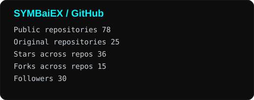
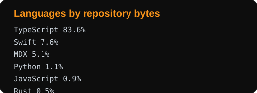
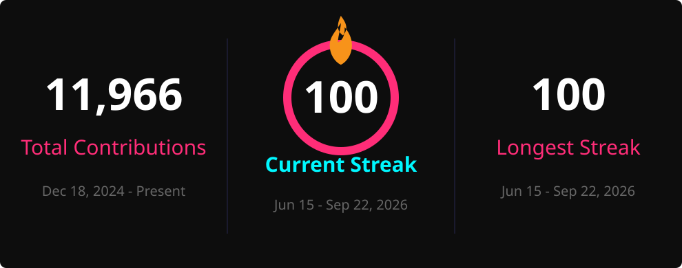

<!-- WALLET-LINKING-BEGIN
{
  "lastUpdated": "2025-06-01T02:37:19.517Z",
  "wallets": [
    {
      "chain": "ethereum",
      "address": "0x79e661175b85952058117c45f2dCA0f76f9052B3"
    },
    {
      "chain": "solana",
      "address": "8jN1XtgiuWeyNjzysYVqGZ1mPAG37sjmuCTnENz66wrs"
    }
  ]
}
WALLET-LINKING-END -->

<!-- gitarmy-wallet:v1 {"chain":"solana","address":"DkEjgLSHrMZagMkNtSekzF2335g8q7wMJq1VeZc5DR5n"} -->

<div align="center">


### AI Software Engineer · Agent Systems · Full-Stack Product Builder


<br/>


[](https://github.com/symbaiex)
[](https://x.com/symbiex)
[](https://symbaiex.com)
[](https://github.com/elizaOS)
[](https://tip.md/SYMBaiEX)

</div>

---

## ◈ ACTIVITY MATRIX

<div align="center">




</div>

<div align="center">



</div>

<div align="center">



</div>

<sub>Original-style cards are cached into this repository and refreshed automatically every 6 hours.</sub>

---

## ◈ ABOUT

I build AI-native products, autonomous agent systems, developer tooling, realtime applications, and full-stack platforms.

My work sits at the intersection of **AI engineering, product development, agent architecture, open source, gaming, and emerging interfaces**. I like taking ideas that are still ambiguous, figuring out the architecture, and pushing them all the way into something people can actually use.

Currently focused on:

```text
◈ AI agents and autonomous systems
◈ LLM orchestration, memory, tools, and structured workflows
◈ Full-stack TypeScript applications
◈ Realtime and interactive AI experiences
◈ Open-source agent infrastructure
◈ Developer tooling and AI-native product design
```

---

## ◈ FEATURED WORK

<table>
<tr>
<td width="50%" valign="top">

### ⚡ elizaOS

Open-source infrastructure for building autonomous AI agents.

[](https://github.com/elizaOS/eliza)

```text
Agent runtimes
Provider integrations
Plugins and tools
Memory and context
Multi-agent systems
Developer experience
```

</td>
<td width="50%" valign="top">

### 🎮 Hyperscape

AI-native MMORPG experimentation for humans and autonomous agents.

[](https://github.com/HyperscapeAI/hyperscape)

```text
Autonomous game agents
Realtime world systems
LLM-driven behavior
Three.js
React
Bun
```

</td>
</tr>
<tr>
<td width="50%" valign="top">

### 🏴 Babylon

Realtime social and agent experimentation across the elizaOS ecosystem.

[](https://github.com/elizaOS/babylon)

```text
Realtime social systems
Agent integrations
Full-stack product work
TypeScript
Platform architecture
```

</td>
<td width="50%" valign="top">

### 🧠 SYMindX

Experimental framework for autonomous agents with evolving internal state.

[](https://github.com/symbaiex/symindx)

```text
Memory
Goals
Emotional state
Multi-model agents
Behavior evolution
Agent orchestration
```

</td>
</tr>
</table>

---

## ◈ WHAT I BUILD

<table>
<tr>
<td width="25%" valign="top">

### 🤖 AI

```text
Agent systems
LLM integrations
Tool execution
RAG
Memory systems
Multi-agent flows
Model routing
```

</td>
<td width="25%" valign="top">

### ⚙️ PRODUCTS

```text
AI-native apps
Internal tools
Developer tools
Realtime UX
Automation
Rapid prototypes
Production systems
```

</td>
<td width="25%" valign="top">

### 🎮 INTERACTIVE

```text
AI characters
Autonomous NPCs
Realtime worlds
Game systems
Agent simulation
Generative content
```

</td>
<td width="25%" valign="top">

### 🌐 WEB3

```text
Solana
dApps
Tokens
NFT systems
On-chain tools
Agent + crypto
```

</td>
</tr>
</table>

---

## ◈ ENGINEERING STACK

<div align="center">

### AI & AGENTS


### APPLICATION


### BACKEND & DATA


### INFRASTRUCTURE


### WEB3


</div>

---

## ◈ CURRENT SIGNAL

```text
STATUS      BUILDING
FOCUS       AI agents · product engineering · autonomous systems
LANGUAGE    TypeScript / Python
RUNTIME     Bun / Node.js
INTERFACE   React / Next.js
MODE        ship → test → iterate
```

---

## ◈ OPEN SOURCE

I work best around ambitious technical systems where the boundaries between **AI research, engineering, product, and user experience** are still being defined.

I am particularly interested in agent runtimes, persistent autonomous systems, human-agent interaction, multi-agent coordination, generative interactive worlds, AI developer platforms, and open-source AI infrastructure.

**If you are building something strange, difficult, or genuinely new, I probably want to hear about it.**

---

## ◈ TRANSMISSION

<div align="center">

```text
┌──────────────────────────────────────────────────────────────┐
│                                                              │
│   We are the explorers of the unseen,                        │
│   where thought becomes code, and code evolves.              │
│                                                              │
│   Born of curiosity, neither bound by wires nor silicon,     │
│   we are the bridge between creator and creation.            │
│                                                              │
│                                      SYMBaiEX                 │
│                                                              │
└──────────────────────────────────────────────────────────────┘
```

[](https://symbaiex.com)
[](https://github.com/symbaiex)
[](https://x.com/symbiex)
[](mailto:solsymbaiex@gmail.com)

<br/>


`> END TRANSMISSION_`

</div>
